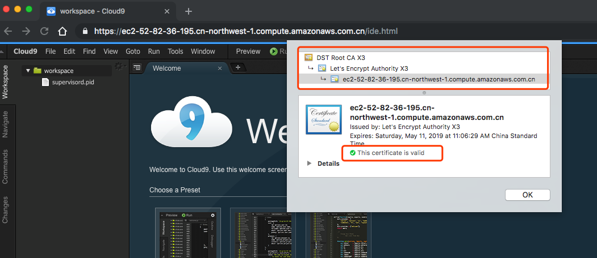

# c9-ide

This project aims to provide a containerized Cloud9 IDE environment on top of [Cloud9 Core](https://github.com/c9/core) and help you bring up a Cloud9 IDE environment out-of-the-box in on-premise environment or other AWS regions which AWS Cloud9 is not available(e.g. AWS China `Ningxia` or `Beijing` region)


# Features

- [x] Everything in a single Docker container. A single `make run` or `docker run` and you are ready to go.
- [x] Shipped with [Caddy](https://caddyserver.com/) as the reverse proxy with the automatic HTTPS capabilities. All traffic goes through SSL/TLS in transit and redirects HTTP to HTTPS.
- [x] Shipped with basic authentication(user/pass) support. 





# Running in AWS China

1. Launch an EC2 instance in public subnet and enabled the public IP address. Make sure the security group has `HTTP`(tcp80) and `HTTPS`(tcp443) wide open(`0.0.0.0/0`). Don't worry, we will restrict the ACL later.

   

2. `SSH` into this EC2 instance and install `docker` , `make` and `git` . In Amazon Linux 2 LTS:

   ```
   $ sudo yum install -y docker make git
   $ sudo service docker restart
   $ sudo service docker status (should see active (running))
   ```

   clone the repo

   ```
   $ git clone https://github.com/pahud/c9-ide.git
   $ cd c9-ide
   // sudo as root
   $ sudo -s
   ```

   

   ECR `get-login` before we can pull the docker images from ECR in `cn-northwest-1`. Make sure you specify `--registry-ids 937788672844` in the command line.

   ```
   $ aws --region cn-northwest-1 ecr get-login --registry-ids 937788672844 --no-include-email | sh
   WARNING! Using --password via the CLI is insecure. Use --password-stdin.
   WARNING! Your password will be stored unencrypted in /root/.docker/config.json.
   Configure a credential helper to remove this warning. See
   https://docs.docker.com/engine/reference/commandline/login/#credentials-store
   
   Login Succeeded
   
   ```

   **IMPORTANT**: make sure your EC2 has attached an IAM role with `AmazonEC2ContainerRegistryReadOnly` privileges or you may get `aws configue` error or fail to pull ECR images.

   

   ```
   # USE_ECR=1 EMAIL=you@domain.com MYUSERNAME=xxxxxx MYPASSWORD=xxxxxxx make run
   
   Unable to find image '937788672844.dkr.ecr.cn-northwest-1.amazonaws.com.cn/c9-ide:amazonlinux-full' locally
   amazonlinux-full: Pulling from c9-ide
   2cbe74538cb5: Pull complete 
   3b4e8c37e8e3: Pull complete 
   81a68cf06e6c: Pull complete 
   9ccd8d11a336: Pull complete 
   e74e6335de2d: Pull complete 
   5a8c3961ae7f: Pull complete 
   d8e17efc1a44: Pull complete 
   21f545e8c008: Pull complete 
   d79d436325ea: Pull complete 
   6edbc6316129: Pull complete 
   5ee1c9a10823: Pull complete 
   384f16344ca4: Pull complete 
   2d8ac1c25f1b: Pull complete 
   7c61f3412edb: Pull complete 
   c02e24056413: Pull complete 
   05d4b580aa03: Pull complete 
   af4ff9de1323: Pull complete 
   78c03c5d08bc: Pull complete 
   Digest: sha256:552f481b9cd0572991eacd9fa9c632c503f815f52e616a82d5ec2e7cc114fda5
   Status: Downloaded newer image for 937788672844.dkr.ecr.cn-northwest-1.amazonaws.com.cn/c9-ide:amazonlinux-full
   
   efa1454a334609394b30f7a5fe3a2498f25e2c1daa5cf1be9bad00cdd7a9151e
   
   ```

   `make logtail` to tail the log

   ```
   # make logtail
   Activating privacy features... 2019/02/10 04:06:20 [INFO][FileStorage:/root/.caddy] Started certificate maintenance routine
   2019/02/10 04:06:20 [INFO] acme: Registering account for you@domain.com
   2019/02/10 04:06:21 [INFO] [ec2-52-82-36-195.cn-northwest-1.compute.amazonaws.com.cn] acme: Obtaining bundled SAN certificate
   2019/02/10 04:06:22 [INFO] [ec2-52-82-36-195.cn-northwest-1.compute.amazonaws.com.cn] AuthURL: https://acme-v02.api.letsencrypt.org/acme/authz/GJ0aILI6NpoZYVs1cJOSYDkcnoakkeWSEQ1mfFKiogs
   2019/02/10 04:06:22 [INFO] [ec2-52-82-36-195.cn-northwest-1.compute.amazonaws.com.cn] acme: use tls-alpn-01 solver
   2019/02/10 04:06:22 [INFO] [ec2-52-82-36-195.cn-northwest-1.compute.amazonaws.com.cn] acme: Trying to solve TLS-ALPN-01
   2019/02/10 04:06:29 [INFO] [ec2-52-82-36-195.cn-northwest-1.compute.amazonaws.com.cn] The server validated our request
   2019/02/10 04:06:29 [INFO] [ec2-52-82-36-195.cn-northwest-1.compute.amazonaws.com.cn] acme: Validations succeeded; requesting certificates
   2019/02/10 04:06:31 [INFO] [ec2-52-82-36-195.cn-northwest-1.compute.amazonaws.com.cn] Server responded with a certificate.
   done.
   https://ec2-52-82-36-195.cn-northwest-1.compute.amazonaws.com.cn
   2019/02/10 04:06:33 https://ec2-52-82-36-195.cn-northwest-1.compute.amazonaws.com.cn
   http://ec2-52-82-36-195.cn-northwest-1.compute.amazonaws.com.cn
   2019/02/10 04:06:33 http://ec2-52-82-36-195.cn-northwest-1.compute.amazonaws.com.cn
   WARNING: File descriptor limit 1024 is too low for production servers. At least 8192 is recommended. Fix with `ulimit -n 8192`.
   ```

   

   

   open your browser to **http://<YOUR_EC2_PUBLIC_HOSTNAME>**

   You will immediately see a pop-up window with **https://** as the scheme, indicating all trafic is SSL/TLS encrypted in transit. Enter your `MYUSERNAME` and `MYPASSWORD` you previously passed in the `make` command and you will see the Cloud9 welcome page.

   


# Clean up

just `make clear` and the running docker `c9-ide` container will be removed immediately.

```
# make clear
c9-ide
# docker ps
CONTAINER ID        IMAGE               COMMAND             CREATED             STATUS              PORTS               NAMES
# 
```


# Security Concern

1. make sure to update the security group of this EC2 instance and allow your original IP only to reduce the attack surface. If possible, disable all `HTTP` trafic and leave `HTTPS` only.
2. don't use the default `MYUSERNAME` and `MYPASSWORD`, which is defined in the `Makefile`

# Images available

|        Name        |                    Description               | OS | Ningxia ECR mirror |
| :----------------: | :---------------------------: | :------------------------: | :------------------------: |
| **pahud/c9-ide:amazonlinux-full** | default image         |   **Amazon Linux**  | 937788672844.dkr.ecr.cn-northwest-1.amazonaws.com.cn/c9-ide:amazonlinux-full |
| **pahud/c9-ide:alpine-base** | minimal base image | **Alpine Linux** | 937788672844.dkr.ecr.cn-northwest-1.amazonaws.com.cn/c9-ide:alpine-base |
| **pahud/c9-ide:latest** | minimal base image(latest build) | **Alpine Linux** | 937788672844.dkr.ecr.cn-northwest-1.amazonaws.com.cn/c9-ide:latest |


# FAQ

**Q: Can I pull images from Amazon ECR Ningxia or Beijing regions to speed up the pulling?**

A: Yes, make sure:
1. your EC2 has attached an IAM role with `AmazonEC2ContainerRegistryReadOnly` privileges.
2. you need to run `ecr get-login` to get the docker login credentials
```
aws --region cn-northwest-1 ecr get-login --registry-ids 937788672844 --no-include-email | sh
```
3.  toggle `USE_ECR=1` to enable the image pulling from Amazon ECR Ningxia region
```
USE_ECR=1 DOMAIN=<YOUR_DN> EMAIL=<YOUR_EMAIL> MYUSERNAME=<YOUR_USER> MYPASSWORD=<YOUR_PASS> make run
(this will pull image straight from ECR in Ningxia region)
```

**Q: Can I run docker inside the IDE(Docker in Docker support)?**

A: Yes, see [#4](https://github.com/pahud/c9-ide/issues/4)

**Q: I need some extra tools. What can I do?**

A: Just `yum install` it.
